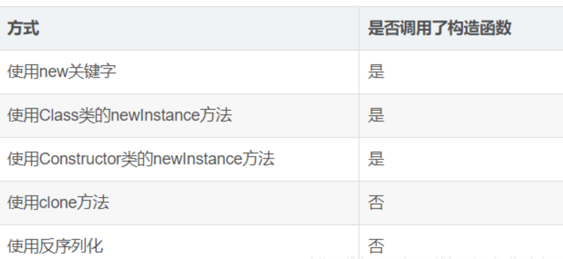
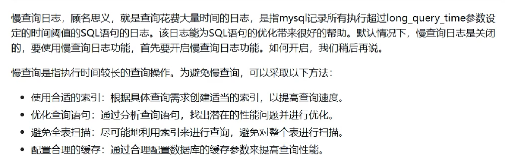
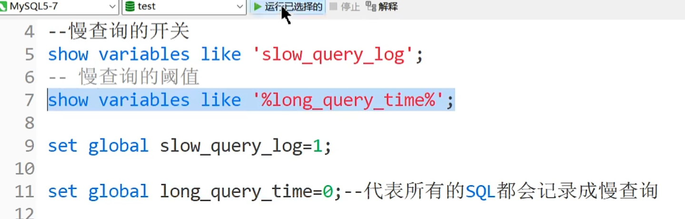

# 面试总结

总：当前回答的是哪些具体的点

分：以 1. 2. 3. 的方式分细节描述相关知识点，如果不清楚直接忽略

   	 突出技术名词(核心概念，接口，类，关键方法)

## Java基础篇

###     1. 描述TCP三次握手四次挥手

- 在TCP协议中，三次握手的具体流程如下：首先客户端向服务器端发送一个SYN包，表示请求建立连接；服务器收到后回复一个SYN+ACK包，表示确认请求并同意建立连接；最后客户端再发送一个ACK包，表示连接建立成功。
- 四次挥手的流程为：首先一方发送一个FIN包，表示要关闭连接；接收到FIN的一方回复一个ACK 包，表示收到关闭请求；然后这一方会发送一个FIN包，表示自己也要关闭连接；最后对方再回复一个ACK包，表示同意关闭连接。这些过程确保了数据的可靠传输和连接的正常关闭。

### 2. 解释Java中多线程的实现方式- 创建线程的方法。

1. 继承Thread类的方式进行实现
    1.自己定义一个类继承Thread
    2.重写run方法，编写线程执行体
    3.创建子类的对象，并用start()方法启动线程

- 实现Runnable接口的方式进行实现
  实现Runnable接口并实现其中的run方法，然后通过构造Thread实例，传入Runnable实现类，然后调用Thread的start方法即可开启一个新线程。
- 利用Callable接口和Future接口方式实现
  首先需要一个实现Callable接口的实例，然后实现该接口的唯一方法call逻辑，接着把Callable实例包装成FutureTask传递给Thread实例启动新线程。FutureTask本质上也实现了Runnable接口，所以同样可以用来构造Thread实例。

  本质上都是实现了Runnable接口

### 3.如何理解String是不可变的？是如何实现的？字符串拼接是如何实现的？

**总**

在Java中，`String`类具有**不可变性**（immutable），这意味着一旦`String`对象被创建，它的值将无法更改。所有对字符串的修改操作（如拼接、替换等）实际上都会生成一个新的字符串对象，而不会修改原对象。不可变性带来了许多好处，比如线程安全性、缓存优化、内存使用效率等。

**分**

- 为什么 `String` 是不可变的？

    - **设计上的原因**

    - **安全性**：`String`被广泛应用于关键操作中，如[类加载](https://so.csdn.net/so/search?q=类加载&spm=1001.2101.3001.7020)、网络传输、数据库连接、文件路径管理等。如果`String`是可变的，那么攻击者或程序中的其他组件可以轻易修改这些重要信息，从而破坏程序的正常运行。不可变性确保了**安全性**，因为一旦创建了字符串对象，其内容就无法被改变。

        例如，数据库连接字符串通常以String类型存储：

        ```
        String dbUrl = "jdbc:mysql://localhost:3306/mydb";
        // 如果String是可变的，恶意代码可以修改dbUrl，导致连接失败
        不可变性保证了这些关键数据不会被恶意修改，从而提升了系统的安全性。
        ```

    - **线程安全**：因为不可变，多个线程可以安全地共享相同的 `String` 对象而无需同步。线程之间共享的数据不会发生变化，避免了数据不一致的问题。

    - **性能优化**：由于 `String` 不可变，Java 实现了字符串常量池（String Pool），用于优化内存。不可变性是字符串池存在的基础，可以在 JVM 中复用相同的 `String` 对象。这样可以减少内存消耗并提高性能

        ```jva
        String str1 = "Hello";
        String str2 = "Hello";
        System.out.println(str1 == str2);  // 输出：true
        ```

        由于不可变性，`str1`和`str2`指向同一个内存中的字符串对象。如果`String`是可变的，共享对象的机制将不再安全

    - **哈希值缓存(可说可不)**：`String`通常被用作哈希表（如`HashMap`、`HashSet`）的键。不可变性使得字符串的**哈希值可以被缓存**，即当首次计算哈希值时，它会被存储起来，后续调用时直接返回缓存的哈希值。由于字符串内容不变，哈希值也不会发生变化，这大大提高了哈希表的查找效率

        如果`String`是可变的，每次修改字符串后，哈希值都需要重新计算，这会降低性能，并可能导致哈希冲突问题。

    - **内部结构**

    - String声明是`final`类型，说明String不可继承，String里面核心存储值的value使用了 `final` 修饰的 `char[]` 数组来存储字符串内容。由于数组是对象，Java 对象是通过引用传递的，因此防止了字符串的内容被修改。(说明`value的引用地址`是不改变的)

        ```
        private final char value[];
        ```

-  `String` 的不可变性是如何实现的？

    - #### `String` 的成员变量是 `final` 的

        `String` 类的所有成员变量都是用 `final` 修饰的，意味着一旦对象被初始化，这些成员变量就不能被重新赋值。

    - **所有修改操作返回新对象**

        在 `String` 类中，所有修改字符串的方法（如 `concat()`、`replace()`）都不会改变原来的字符串，而是返回一个新的 `String` 对象。

        ```java
        String s = "hello";
        s = s.concat(" world");  // s 的值变成 "hello world"，但原始的 "hello" 字符串未被修改
        ```

        这确保了每次操作都会生成一个新的对象，原来的对象保持不变。

- 字符串拼接是如何实现的？

    - 使用 `+` 拼接

        当使用 `+` 操作符拼接字符串时，Java 实际上会在编译时将其优化为 `StringBuilder` 的 `append()` 操作。如果在一个循环中频繁使用 `+` 拼接字符串，会导致产生大量临时对象，性能较低。

        ```
        String str = "Hello" + ", World!";
        ```


        上面的代码在编译后会变成：
    
        ```
        StringBuilder sb = new StringBuilder("Hello");
        sb.append(", World!");
        String str = sb.toString();
        ```

- StringBuilder` 和 `StringBuffer

    - **`StringBuilder`** 是一个可变类，适用于单线程环境，用于高效地进行字符串的拼接。它通过维护一个可变的字符数组来动态修改内容，避免了大量的临时对象创建。(性能高但是不安全)
    - **`StringBuffer`** 类似于 `StringBuilder`，但它是线程安全的，所有方法都使用 `synchronized` 修饰。(性能较之低但是安全)

    `StringBuffer`与`StringBuilder`类似，但它是线程安全的，适用于多线程环境下的字符串修改。


### 4.我们可以在 hashcode() 中使用随机数字吗？

 不行，因为同一对象的 hashcode 值必须是相同的

- 如果两个对象根据 equals(Object obj) 方法比较是相等的，则调用 hashCode() 必须为这两个对象产生相同的整数结果。

- 如果根据 equals(Object obj) 方法，两个对象不相等，则 hashCode() 方法不一定要产生不同的整数结果。(可能一样)

    ```
    hashCode 的常规协定是：   
    在 Java 应用程序执行期间，在同一对象上多次调用 hashCode 方法时，必须一致地返回相同的整数，前提是对象上 equals 比较中所用的信息没有被修改。从某一应用程序的一次执行到同一应用程序的另一次执行，该整数无需保持一致。   
    如果根据 equals(Object) 方法，两个对象是相等的，那么在两个对象中的每个对象上调用 hashCode 方法都必须生成相同的整数结果。   
    以下情况不 是必需的：如果根据 equals(java.lang.Object) 方法，两个对象不相等，那么在两个对象中的任一对象上调用 hashCode 方法必定会生成不同的整数结果。但是，程序员应该知道，为不相等的对象生成不同整数结果可以提高哈希表的性能。   
    实际上，由 Object 类定义的 hashCode 方法确实会针对不同的对象返回不同的整数。（这一般是通过将该对象的内部地址转换成一个整数来实现的，但是 JavaTM 编程语言不需要这种实现技巧。）   
      
    当equals方法被重写时，通常有必要重写 hashCode 方法，以维护 hashCode 方法的常规协定，该协定声明相等对象必须具有相等的哈希码。  
    ```

- ```
    hashCode
    hashCode：是Java的本地方法，通过对象的内存地址（不止内存地址）计算出一个整数值，少数情况下，内存地址不同，这个整数值也有可能是相同的。例：Aa和BB的hashCode值是相同的
    二、equals
    equals：是Java的本地方法，默认比较的是两个对象的内存地址是否相同。
    三、结论：
    综上所述可知，Aa和BB的hashCode值是相同的，但是他们的内存地址并不相同,equals不等，即两个对象的 hashCode()相同，则 equals()也一定为 true使错误的。
    四、题外话：
    hashMap 判断一个对象是否相等，首先通过比较对象的hashcode值是否相同，若是相同，再比较equals是否相同，若是不同，则可判定两个对象为不同的对象。
    当我们重写一个对象的equals方法时，必须同时重写对象的hashCode方法，这是为了避免出现两个对象相同，但是hashCode值却不同的情况
    
    ```

#### 4.1.equals()和==区别，为什么重写equals要重写hashcode？

- 使用上的一个区别

    == 是运算符  equals来自于Object类定义的一个方法

    == 可以用于基本数据类型和引用类型

    equals 只能用于引用类型

- ==两端如果是基本数据类型，就是判断值是否相等

    equals在重写后，判断两个对象的属性值是否相同

    equals如果不重写，其实就是==

- 重写equals可以让我们自己定义判断两个对象是否相同的条件

    Object中定义的hashcode方法生成的哈希码能保证同一个对象的哈希码一定是不同的

    当equals返回true，我们在逻辑上就可以认为是同一个对象，但是查看哈希码却可能不同（如果没重写），和equals方法返回的结果违背

- hashmap中，借助equals和hashcode方法来完成对象的存储

- hashCode 和 equals 两个方法是用来协同判断两个对象是否相等的，采用这种方式的原因是可以提高程序插入和查询的速度，如果在重写 equals 时，不重写 hashCode，就会导致在某些场景下，例如将两个相等的自定义[对象存储]在 Set 集合时，就会出现程序执行的异常，为了保证程序的正常执行，所以我们就需要在重写 equals 时，也一并重写 hashCode 方法才行。

### 5.什么是序列化？什么是反序列化？说说有几种序列化方式？

- 序列化是指将对象转换为字节序列的过程。这使得对象可以跨网络进行传输，或者以二进制形式在文件或数据库中存储。

- 反序列化是指将字节序列转换回Java对象的过程。

- JDK 自带的序列化，只需实现 `java.io.Serializable`接口即可。

- **原生序列化方式**

    序列化方式一： 实现[Serializable](https://so.csdn.net/so/search?q=Serializable&spm=1001.2101.3001.7020)接口(隐式序列化)

    - 如何序列化对象？

        1. 创建一个`FileOutputStream`或`ByteArrayOutputStream`用于将数据写入文件或内存。

        2. 创建一个`ObjectOutputStream`以将数据写入输出流。

        3. 使用`ObjectOutputStream`的`writeObject()`方法将Java对象写入输出流，完成序列化。

            ```java
            import java.io.FileOutputStream;
            import java.io.ObjectOutputStream;
            
            public class SerializationExample {
               
                public static void main(String[] args) {
               
                    Person person = new Person("John", 25);
            
                    try {
               
                        FileOutputStream fileOut = new FileOutputStream("person.ser");
                        ObjectOutputStream out = new ObjectOutputStream(fileOut);
            
                        out.writeObject(person);
            
                        out.close();
                        fileOut.close();
                        System.out.println("Object serialized successfully.");
            
                    } catch (Exception e) {
               
                        e.printStackTrace();
                    }
                }
            }
            ```

            在上述示例中，我们将`Person`对象写入名为`person.ser`的文件中。

    - 怎么反序列化？

        - 它使用Java中的`ObjectInputStream`实现，可以将序列化的字节流重新转换为原始对象。

            ```
            import java.io.FileInputStream;
            import java.io.ObjectInputStream;
            
            public class DeserializationExample {
               
                public static void main(String[] args) {
               
                    try {
               
                        FileInputStream fileIn = new FileInputStream("person.ser");
                        ObjectInputStream in = new ObjectInputStream(fileIn);
            
                        Person person = (Person) in.readObject();
            
                        in.close();
                        fileIn.close();
                        // 打印反序列化后的对象信息
                        System.out.println("Name: " + person.getName());
                        System.out.println("Age: " + person.getAge());
                    } catch (Exception e) {
                        e.printStackTrace();
                    }
                }
            }
            ```

            在上述示例中，我们从名为`person.ser`的文件中读取字节流，并将其转换回`Person`对象。

- **Json序列化**
    Json序列化一般会使用jackson包，通过ObjectMapper类来进行一些操作，比如将对象转化为byte数组或者将json串转化为对象。现在的大多数公司都将json作为服务器端返回的数据格式。比如调用一个服务器接口，通常的请求为xxx.json?a=xxx&b=xxx的形式。Json序列化示例代码如下所示

- **FastJson序列化**
    fastjson 是由阿里巴巴开发的一个性能很好的Java 语言实现的 Json解析器和生成器。特点：速度快，测试表明fastjson具有极快的性能，超越任其他的java json parser。功能强大，完全支持java bean、集合、Map、日期、Enum，支持范型和自省。无依赖，能够直接运行在Java SE 5.0以上版本
    支持Android。使用时候需引入FastJson第三方jar包。

​		**扩展**

- 序列化版本控制：如果在序列化过程中更改了类的结构，例如添加或删除字段，可能会导致反序列化失败。为了解决这个问题，可以在类中添加一个名为`serialVersionUID`的静态字段，用于控制版本号。
- 对象引用和循环引用：在对象之间存在引用关系时，需要确保所有相关的对象都是可序列化的。否则，可能会遇到`NotSerializableException`异常。此外，循环引用也需要特殊处理，以避免无限循环序列化。
- 敏感信息保护：在序列化对象时，需要谨慎处理敏感信息，例如密码或个人身份信息。可以使用`transient`关键字将字段标记为瞬态，以在序列化过程中排除它们。


### 6.Java中创建对象的方式有几种？

五种



- **Class.newInstance**

    这是我们运用反射创建对象时最常用的方法。**Class类的newInstance**使用的是类的`public的无参构造器`。因此也就是说使用此方法创建对象的前提是**必须有public的无参构造器才行，否则报错**

    ```
    public class Main {
    
        public static void main(String[] args) throws Exception {
            Person person = Person.class.newInstance();
            System.out.println(person); // Person{name='null', age=null}
        }
    
    }
    ```

- **Constructor.newInstance**

    本方法和Class类的`newInstance`方法很像，但是比它强大很多。 **java.lang.relect.Constructor类里也有一个newInstance方法可以创建对象。我们可以通过这个**`**newInstance**`**方法调用有参数（不再必须是无参）的和私有的构造函数（不再必须是public）**。

- **Clone**

    无论何时我们调用一个对象的`clone`方法，JVM就会创建一个新的对象，将前面的对象的内容全部拷贝进去，用`clone`方法创建对象`并不会调用任何构造函数`。 要使用clone方法，我们**必须先实现Cloneable接口**并复写Object的clone方法（因为Object的这个方法是protected的，你若不复写，外部也调用不了呀）

    ```
    public class Person implements Cloneable {
    	...
    	// 访问权限写为public，并且返回值写为person
        @Override
        public Person clone() throws CloneNotSupportedException {
            return (Person) super.clone();
        }
        ...
    }
    
    public class Main {
    
        public static void main(String[] args) throws Exception {
            Person person = new Person("fsx", 18);
            Object clone = person.clone();
    
            System.out.println(person);
            System.out.println(clone);
            System.out.println(person == clone); //false
        }
    
    }
    ```

- 反序列化

    当我们序列化和反序列化一个对象，JVM会给我们创建一个单独的对象，在反序列化时，JVM创建对象并**不会调用任何构造函数**。

    为了反序列化一个对象，我们需要让我们的类实现`Serializable`接口。

    ```
    public class Main {
    
        public static void main(String[] args) throws Exception {
            Person person = new Person("fsx", 18);
            byte[] bytes = SerializationUtils.serialize(person);
    
            // 字节数组：可以来自网络、可以来自文件（本处直接本地模拟）
            Object deserPerson = SerializationUtils.deserialize(bytes);
            System.out.println(person);
            System.out.println(deserPerson);
            System.out.println(person == deserPerson);
        }
    
    }
    ```

    ##### 关于两种newInstance方法的区别？

    1. Class类位于java的lang包中，而Constructor是java反射机制的一部分
    2. Class类的`newInstance只`能触发**无参数的**构造方法创建对象，而构造器类的`newInstance`能触发**有参数或者任意参数**的构造方法来创建对象。
    3. Class类的newInstance需要其构造方法**是public的或者对调用方法可见的**，而构造器类的newInstance可以**在特定环境下**调用私有构造方法来创建对象。
    4. Class类的newInstance抛出类构造函数的异常，而构造器类的newInstance包装了一个`InvocationTargetException`异常。

### 7.能谈谈你对面向对象的三大特征的理解吗？

Java面向对象编程（Object-Oriented Programming，简称OOP）的三大特征是封装（Encapsulation）、继承（Inheritance）和多态（Polymorphism）。
- 1、封装（Encapsulation）： 封装是将数据（属性）和操作（方法）捆绑在一起，形成一个类（Class）。类将数据和操作封装在一个逻辑单元中，并隐藏内部实现细节，只暴露对外公开的接口，以便其他对象使用。这样可以保护数据不被直接访问和修改，只能通过类提供的方法进行访问和操作，从而确保数据的安全性和一致性。
- 2、继承（Inheritance）： 继承是通过创建一个新类（子类）来继承现有类（父类）的属性和方法。子类继承了父类的特性，包括字段和方法，而无需重复编写相同的代码。子类还可以添加新的字段和方法，或者覆盖父类的方法（重写），从而实现功能的扩展和定制。
- 3、多态（Polymorphism）： 多态是指同一个方法名可以在不同的对象上具有不同的行为。它允许使用父类引用去指向子类对象，然后在运行时根据对象的实际类型来调用对应的方法。多态提高了代码的扩展性和灵活性，是的程序可以在不修改当前代码的基础下，通过引入新的子类来扩展功能


## Mysql

###    1.Mysql的优化可以从哪些方面考虑

- 索引优化

    索引是加速查询数据库的关键，在设计表结构的时候，应该根据查询的需求添加合适的索引，常用的索引包括主键，唯一索引，普通索引，全文索引等

    同时要避免过多的索引，创建一个索引就需要创建一棵B+树，会占用存储空间，会影响写入性能

- 查询优化

    优化查询条件，要尽可能使用索引，避免全表扫描，同时。要避免使用子查询，尽可能使用连接查询，避免使用“%”等通配符，避免多余的字段

- 数据库表结构优化

    合理的表结构可以提高查询效率和减少存储空间，应该避免使用大字段，如text,Blob等，因为这些字段会占用大量的存储结构，可以把他单独存放，与主表关联，同时避免冗余字段

- 缓存优化

    使用缓存可以大大减轻MySQL数据库的压力，提高查询效率，比如Redis

- 分区分表优化

    对于数据量比较大的表，可以使用分区分表技术进行优化，提高查询效率

- 配置优化

    调整MySql配置，包括缓存区，连接数，线程数等

### 2.什么是慢查询，如何理解






### 3.什么是执行计划，怎么理解


### 4.如何优化表结构

- 索引的类型尽量小

- 索引的选择性:比如不要选择性别，筛选不出东西

- 前缀索引

- 只为用于搜索，排序或者分组的列创建索引

- 多列索引的优化

    最左匹配原则-->B+树的结构--联合索引

### 5.Mysql如何避免死锁

死锁是指两个或多个事务互相等待资源释放，从而导致无法继续进行的情况，为避免死锁，有以下措施

- 合理设置表结构
    - 将相关数据分散到多个表中，以减少锁的竞争。

- 给事务加锁顺序：确保所有事务以相同的顺序访问表和行，从而减少循环依赖的可能性。
- 设置合理的超时时间：对于被锁定资源，设置合理的超时时间，避免长时间等待导致死锁
- 控制事务大小：尽量缩短事务的执行时间，确保尽快释放锁。


### 6.如何优化大量数据插入的性能

- 先关闭索引，插入后再开启

- **数据提交方面**：批量提交
- **数据库引擎方面**：MyisAM

- `Myisam`比`innodb`有更好的插入性能，但失去了事务支持，批量插入时无法保证同时成功或失败，所以当批量插入超时或失败时，如果重试，势必对导致一些重复数据的发生。但是为了保证更快的导入速度，可以把myisam存储引擎列为计划之一


## SpringBoot

###    1.谈谈对Spring IOC的理解，原理，实现

**总**

- 控制反转：理论思想，原来的对象是由使用者进行控制，有了spring之后，可以把整个对象交给Spring来帮我们管理

    - DI:依赖注入，把对应的属性的值注入到具体的对象中，@Autowired ，		

         	popularBean完成属性值的注入

- 容器：存储对象，使用map结构来存储，在spring中一般存在**三级缓存**，singletonObject存 

    ​			放完整的bean对象	

    ​			整个**bean的生命周期**，从创建到销毁的过程全部是由容器来管理(bean的生命周期)	

**分**

1.一般聊ioc容器要涉及容器的创建过程(beanFactory，defaultListableBeanFactory),向bean工厂设置一些参数

​	(beanPostProcessor)等等属性

2.加载解析bean对象，准备要创建的bean对象的定义对象beanDefinition，(xml或者注解的解析过程)

3.beanFactorPostProcessor的处理，此处是扩展点PlaceHolderConfigurationsupport，configurationClassPostProcessor

4.BeanPostProcessor的注册功能，方便对bean对象完成具体的扩展功能

5.通过反射的方式讲BeanDefinition对象实例化成具体的bean对象

6.bean对象的初始化过程(填充属性，调用aware子类的方法，调用BeanPostProcessor的前置处理方法，调用init-method方法，

​	调用BeanPostProcessor的后置处理方法)

7.生成完整的bean对象，通过getbean方法直接获取

8.销毁过程

面试官，这是我对ioc的整体理解，包含了一些具体流程，您看有什么问题

**没看过源码怎么办**
		  具体的细节我记不太清了，但是spring中的bean都是通过反射生成的，同时其中包含了许多的扩展点，比如常见的对beanFactory的扩展，对bean的扩展（对占位符的处理），在这方面用的比较多，除此之外，ioc中最核心的也就是填充具体bean属性，和生命周期


*BeanFactory是Bean的工厂，可以帮我们生成想要的Bean，而FactoryBean就是一种Bean的类型。当往容器中注入class类型为FactoryBean的类型的时候，最终生成的Bean是用过FactoryBean的getObject获取的。*


### 2.谈一下SpringIoc的底层实现

**你对他的理解和你了解过的实现过程**

反射，工厂，设计模式（会不会） 关键的几个方法

createBeanFactory getbean，doGetbean,createBean,doCreateBean,createBeanInstance,populateBean,initializingBean

1.先通过createBeanFactory 创建出一个Bean工厂(DefaultListable)

2.开始循环创建对象，因为容器中的bean默认都是单例的，所以优先通过getBean,doGetBean从容器中查找，找不到的话

3.通过createBean，doCreateBean方法，以反射的方式创建对象，一般情况下使用的是无参的构造方法(getDeclaredCondtrcutor,newInstance)

4.进行对象的属性填充populateBean

5.进行其他初始化操作(initializingBean)

### 3.描述一下bean的生命周期

记住图流程，针对图扩展描述

1.实例化bean：反射的方法生成对象

2.填充bean的属性：PopulateBean(),循环依赖的问题(三级缓存)

3.调用aware接口相关方法 invokAwareMethod(完成BeanName，BeanFactory，BeanClassLoader对象的属性设置)

4.调用BeanPostProcessor中的前置处理方法：使用比较多的（ApplicationContextPostProcessor,设置ApplicationContext，Environment,ResourceLoader,EmbeddValueResolver等对象）

5.调用initmethod方法：invokinitmethod(),判断是否实现了initiazingBean接口，如果有，调用afterPropertiesSet方法，没有就不调用

6.调用BeanPostProcesser的后置处理方法：spring的AOP就是在此实现的，AbstractAutoProxyCreator

7.获取到完整的对象，可以通过getbean的方式来进行对象的获取

8.销毁流程：1.判断是否实现了DispoableBean接口， 2.调用destroyMethod方法
